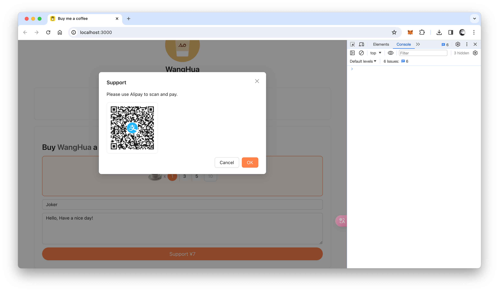

# Buy me a coffee



这是一个使用 React 基于 T1 后端云云函数+云数据库+支付宝+实现的一个“请我喝一杯咖啡”程序，使用前需修改 `src/App.tsx` 中的 `url` 为您自己的云函数应用 ID 地址；并将以下两个云函数导入到您自己的 T1 后端云云函数中（确保设置/支付配置已经配置）然后您就可以愉快的玩耍了：

## pay

```js
function main() {
  const name = ctx.query("name");
  const money = ctx.query("money");
  const content = ctx.query("content");
  const timestamp = new Date().getTime();
  const randomDigits = Math.floor(Math.random() * 1000000)
    .toString()
    .padStart(6, "0");
  const sys_out_trade_no = `${timestamp}${randomDigits}`;
  const notify_url = "https://api.t1y.net/1436/notify"; // 修改应用ID为您自己的ID
  const qr_code = alipay.create(
    "Buy a coffee",
    sys_out_trade_no,
    money,
    notify_url,
    "https://www.baidu.com/"
  );
  if (qr_code == null) {
    console.error("fail");
    return "fail";
  }
  db.createOne("history", {
    name: name,
    money: money,
    content: content,
    sys_out_trade_no: sys_out_trade_no,
    status: false,
  });
  ctx.redirect(302, qr_code);
  return "success";
}
```

## notify

```js
function main() {
  const body = ctx.getBody();
  if (alipay.notifySignVerify()) {
    if (ctx.postForm("trade_status") == "TRADE_SUCCESS") {
      db.updateOne(
        "history",
        { sys_out_trade_no: ctx.postForm("out_trade_no") },
        { $set: { status: true } }
      );
      console.success("success");
    }
    return "success";
  }
  return "fail";
}
```
